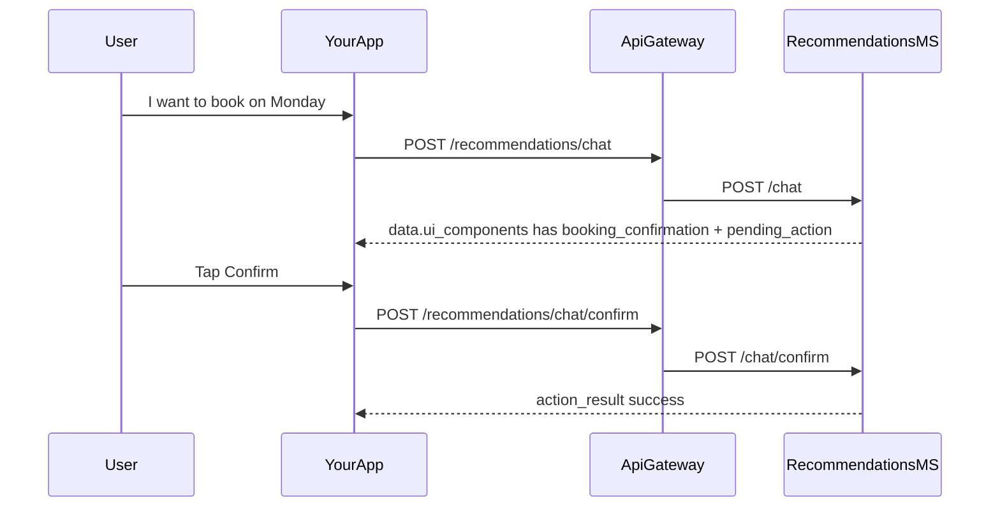

# Hygieia Patient Chatbot — Frontend Integration

API base: **`{API_BASE}/recommendations`** (api-gateway, default `http://localhost:4000/recommendations` if gateway runs on 4000).

> Streaming (SSE) is **not** enabled in v1. Show a typing/loading state until the HTTP response returns.

## Backend contract needed for production-grade chat history UX

For a ChatGPT-style sidebar with reopenable conversations, the backend should support all of the following. The frontend can work with the current turn-based chat API, but it cannot deliver a real conversation sidebar without these additions.

1. Conversation list endpoint for one patient.
2. Rich message history payload with structured UI state.
3. Stable cursor pagination for history and conversation lists.
4. Conversation lifecycle actions such as rename and unarchive.
5. Ownership checks that validate the token subject, not just the query parameter.
6. Optional search and total count support for sidebar UX.

---

## 1. Endpoints (via api-gateway)

| Method | Path | Description |
|--------|------|-------------|
| `POST` | `/recommendations/chat` | Send a chat turn; receive assistant message + UI components |
| `POST` | `/recommendations/chat/confirm` | Execute a **pending** write (booking, cancel, etc.) after user taps Confirm |
| `GET` | `/recommendations/chat/conversations/:patientId` | Conversation list for the sidebar |
| `GET` | `/recommendations/chat/history/:patientId` | Rich paginated message history (Mongo) |
| `PATCH` | `/recommendations/chat/:conversationId/title` | Rename a conversation |
| `POST` | `/recommendations/chat/:conversationId/unarchive` | Optional restore after archive |
| `DELETE` | `/recommendations/chat/:conversationId?patient_id=...` | Soft-archive a session |

**Wrappers in NestJS** return `{ statusCode, message, data, success: true }` where **`data` is the Python payload** below (except where noted).

### `GET /recommendations/chat/conversations/:patientId`

Use this endpoint to populate the left sidebar or conversation drawer.

**Query**

- `limit` - max number of conversations to return.
- `before` - cursor for pagination, usually the last `updated_at` or a stable cursor token.
- `include_archived` - include archived conversations when true.
- `search` - optional text search across title, preview, or last message content.

**Response `data`**

```ts
export interface ConversationListItem {
  conversation_id: string
  title: string
  preview: string
  created_at: string
  updated_at: string
  archived_at: string | null
  message_count: number
  last_message_role: 'assistant' | 'user' | 'system'
}

export interface ConversationListResponseData {
  items: ConversationListItem[]
  has_more: boolean
  next_before: string | null
  total_conversations?: number
}
```

### `GET /recommendations/chat/history/:patientId`

Use this endpoint when reopening a conversation. It should return the full replay payload, including structured UI state that the frontend can render again.

**Query**

- `conversation_id` - required when loading a specific thread.
- `limit` - default 50, max 200.
- `before` - cursor for stable pagination, either by timestamp or message id, but the contract must be deterministic.

**Response `data`**

```ts
export interface ChatHistoryMessage {
  message_id: string
  conversation_id: string
  role: 'assistant' | 'user' | 'system'
  content: string
  created_at: string
  ui_components?: Record<string, unknown>[]
  quick_replies?: { label: string; send: string }[]
  pending_action?: PendingAction | null
}

export interface ChatHistoryResponseData {
  items: ChatHistoryMessage[]
  has_more: boolean
  next_before: string | null
}
```

Recommended ordering: document it explicitly and keep it stable. Oldest-to-newest is usually easiest for replay, but newest-to-oldest is acceptable if the API says so and the cursor logic matches.

### `POST /recommendations/chat`

**Body (JSON)**

```json
{
  "patientId": "uuid",
  "messages": [
    { "role": "user", "content": "Show me available doctors" }
  ],
  "conversationId": "optional-uuid",
  "confirmActionToken": "optional—if you confirm inside the same request"
}
```

- `patientId` — the logged-in **patient** user id (Supabase `users.id`).
- `messages` — include at least the **latest** user turn; you may also send a short local thread for context, but the server will merge with MongoDB history.
- `conversationId` — omit on **first** message; store the returned `data.conversation_id` and send on later turns.
- `confirmActionToken` — **optional**; you can also call `POST /recommendations/chat/confirm` instead (recommended after Confirm click).

**Headers (optional but recommended in prod)**

- `Authorization: Bearer <access_token>` — will be forwarded to the gateway for downstream service calls if you configure the backend accordingly.

**Response `data` (Python shape)**

```ts
// See §2 TypeScript types; shape matches Python JSON.
```

### `POST /recommendations/chat/confirm`

**Body**

```json
{
  "patientId": "uuid",
  "conversationId": "uuid",
  "actionToken": "uuid-from-pending"
}
```

Use the `actionToken` (or the token inside `ui_components` → `booking_confirmation.action_token`).

### `PATCH /recommendations/chat/:conversationId/title`

**Body**

```json
{
  "patientId": "uuid",
  "title": "Follow-up with Dr. Khan"
}
```

This should rename the conversation and return the normalized updated conversation record.

### `POST /recommendations/chat/:conversationId/unarchive`

**Body**

```json
{
  "patientId": "uuid"
}
```

This is optional, but useful if the UI allows restoring archived conversations.

### `DELETE /recommendations/chat/:conversationId?patient_id=<uuid>`

**Query:** `patient_id` (required) — must match the session owner.

The delete/archive response should return a normalized payload with the final `archived_at` timestamp and a success confirmation.

---

## 2. Copy-paste TypeScript types

```typescript
// types/patient-chat.ts

export interface ChatRequest {
  patientId: string
  messages: { role: string; content: string }[]
  conversationId?: string
  confirmActionToken?: string
}

export interface ChatConfirmRequest {
  patientId: string
  conversationId: string
  actionToken: string
}

export interface ChatMessageOut {
  role: 'assistant' | 'user' | 'system'
  content: string
  created_at: string
}

export interface ChatHistoryMessage {
  message_id: string
  conversation_id: string
  role: 'assistant' | 'user' | 'system'
  content: string
  created_at: string
  ui_components?: Record<string, unknown>[]
  quick_replies?: { label: string; send: string }[]
  pending_action?: PendingAction | null
}

export interface ConversationListItem {
  conversation_id: string
  title: string
  preview: string
  created_at: string
  updated_at: string
  archived_at: string | null
  message_count: number
  last_message_role: 'assistant' | 'user' | 'system'
}

export interface ChatMeta {
  model: string
  latency_ms: number
  error?: string
}

export type UiComponent = DoctorList | /* … */ Record<string, unknown>
// Use discriminated union on `type` (see §3)

export interface ChatResponseData {
  conversation_id: string
  message: ChatMessageOut
  ui_components: Record<string, unknown>[]
  quick_replies: { label: string; send: string }[]
  pending_action: PendingAction | null
  meta: ChatMeta
}

export interface ChatHistoryResponseData {
  items: ChatHistoryMessage[]
  has_more: boolean
  next_before: string | null
}

export interface ConversationListResponseData {
  items: ConversationListItem[]
  has_more: boolean
  next_before: string | null
  total_conversations?: number
}

export interface PendingAction {
  action: string
  action_token: string
  summary: string
  args: Record<string, unknown>
}
```

---

## 3. `ui_components[]` — stable `type` field

**Rendering rule:** `switch (component.type)`; if `type` is unknown, render a generic `text` or JSON fallback (never crash).

| `type` | Key fields | Render hint |
|--------|------------|-------------|
| `doctor_list` | `items[]` — `id`, `name`, `email?`, `phone?`, `img?` | Card grid: avatar, name, email; primary action **Book** → send `I want to book with doctor <id>` or show slot picker. |
| `nutritionist_list` | same | Same as doctor; role may be nutritionist. |
| `lab_technician_list` | same | “Lab team” list. |
| `lab_test_list` | `items[]` — `id`, `name`, `code?`, `description?`, `price?` | Test cards; **Book** → prefill `write_book_lab_test` path via user message. |
| `available_slots` | `provider_id`, `role`, `date`, `slots: { time, location? }[]`, `message?` | Slot chips; user taps a time → then confirm booking in chat. |
| `appointment_list` | `items[]` (camel or snake) | List upcoming/past. |
| `prescription_list` | `items[]` | Medication list as expandable cards. |
| `medication_log_list` | `items` | Timeline / date groups. |
| `medical_record_list` | `items[]` — `title`, `record_type`, `date`, `file_url?` | Row with download/open link. |
| `fitness_summary` | numeric fields | 2×4 stat grid. |
| `lab_booking_list` | `items` | Booked tests; cancel via chat flow. |
| `recommendation_list` | `recommendations[]`, `generated_at?` | Cards per recommendation. |
| `booking_confirmation` | `action`, `action_token`, `summary`, `tool_args`, `confirm_label`, `cancel_label` | **Required:** primary **Confirm** and secondary **Cancel**; Confirm → `POST .../chat/confirm`. |
| `action_result` | `status`, `title`, `body`, `data?` | Result toast / banner. |
| `text` | `body` | Markdown. |
| `error_card` | `title`, `body` | Inline error. |
| `quick_replies` | `items: { label, send }[]` | Chips; `send` string becomes the **next** `messages[0].content` for a new `POST /chat` turn. |

---

## 4. Confirmation flow (writes)

**Writes are two-step:** the model proposes; the user must **Confirm**; then the app calls the confirm API.



### Worked example A — book appointment (proposal)

1. `POST /chat` with: “Book Dr. `uuid` for 2026-04-30 at 10:00”
2. Response includes `booking_confirmation` and `message.content` asking to confirm.
3. User confirms → `POST /recommendations/chat/confirm` with `actionToken`.

### Worked example B — cancel lab booking

1. User: “Cancel my last lab booking”
2. Assistant may call read tools, then `write_cancel_lab_booking` → `booking_confirmation`.
3. Confirm with `actionToken` as above.

### Worked example C — log medication taken

1. User: “I took my morning med”
2. `write_log_medication_taken` may be proposed; confirm the same way.

---

## 5. Backend expectations for sidebar UX

To support a production chat sidebar, the backend should also do the following.

- Generate a default conversation title from the first user message, or from a short summary once the thread has enough context.
- Support `total_conversations` in the conversation list response so the UI can render pagination and empty states accurately.
- Allow search over title, preview, and optionally recent message content.
- Return `archived_at` as `null` for active conversations and a timestamp for archived ones.
- Enforce ownership using the access token subject plus the `patientId` / `patient_id` parameter, not the parameter alone.
- Keep pagination order deterministic and document whether the cursor is based on `created_at`, `updated_at`, or `message_id`.

---

## 6. Quick-replies

- Chips are optional; if present, on tap: send a **new** `POST /chat` with a single user message: `{ role: "user", content: chip.send }`.
- Keep the same `conversationId`.

---

## 7. Error handling (HTTP)

| Status | Suggested user message |
|--------|------------------------|
| 400 | Show `detail` / `message` from the JSON body. |
| 404 | “Session or resource not found.” (e.g. history or delete) |
| 503 | “Assistant temporarily unavailable, try again.” |
| 500/502 | “Something went wrong, try again or contact support.” |

---

## 8. Versioning

- New `type` values may be added. **Always** branch on `type` and have a `default` renderer.

---

## 9. Gateway vs direct recommendations service

- **Frontend should call the gateway** (`/recommendations/...`) in production.
- The Python service also exposes the same paths under the microservice **without** the `/recommendations` prefix: `http://<host>:4012/chat` if you need it for local debugging.
